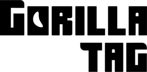

# Gorilla Tag Mod Developer Documentation
## Welcome

This document contains documentation on the internal libraries and creation of Gorilla Tag mods. Please note that modding is NOT supported by Another Axiom or Lemming and is
bannable if server-sided. This document is NOT made by or affiliated with Another Axiom or Gorilla Tag. This is community-made. For information, contact a maintainer:

``Oscar, Project Lead. Discord: oscar_gtdev``

# Table Of Contents
Any chapters in plain white text are not done yet.
- [Mods Classification](#mods-classification)
  - [Legal Mods](#legal-mods)
  - [Illegal Mods](#illegal-mods)
  - [Make Sure Your Mod Is Legal](#make-sure-your-mod-is-legal)
- [Prerequisites](#prerequisites)
- [(1) Utilla](#chapter-1-utilla)
  - [(1.1) Mod Initialization](#chapter-11-mod-initialization)

# Mods Classification
## Legal Mods
Legal mods are mods that do not interfere with the server side of the game. These are client-side only mods that do not give you a competitive advantage.

Some of these mods include:
- [Yizzi’s Camera Mod](https://github.com/yizzii/YizziCamModV2): A client-sided camera mod that lets you control the FOV, camera position, and other client-side only mod.
  This is NOT bannable.
- [Oscar’s FPV](https://github.com/oscargtag/fpv): First-Person Camera mod. Will change the PC camera that shows your avatar in third person. This is NOT bannable.

## Illegal Mods
Illegal Mods give you a competitive advantage or are server-sided and interfere with the game. These include:
- ii’s Stupid Menu: A mod menu that provides many illegal mods. This is VERY bannable.
- PlayerTrakkar: A player tracker. Player trackers are a guaranteed ban with no appeal.

## Make Sure Your Mod Is Legal
Legal mods are the only mods that will not get you banned. Using a library that provides a safe space for modding, like Utilla will decrease the chance of you getting banned.

When you develop a mod, ensure your mod is not bannable. Making legal mods is way more shined upon over illegal mods.

# Prerequisites
Before you begin using this guide to develop mods, you should know how to use these tools, understand these concepts, and know how to implement them or use them effectively.

- Unity: The game engine Gorilla Tag is built in. This is essential as not knowing Unity’s libraries will make developing mods very difficult for you.
- C#, or the .NET Framework: .NET is a framework for the C# language that Gorilla Tag uses. All mods are coded in C#. This is required to code any mods. If you have used a
  software like Windows Forms, you may already know what is required to use it.
- Utilla: A utility for implementing your mod. It lets you use it’s built-in modded lobbies feature, which should be implemented if your mod gives you a competitive advantage.

# Chapter 1. Utilla
Utilla will help you code your mod by giving you an arsenal of functions and events to develop with.
## Chapter 1.1. Mod Initialization
To use Utilla, you must first call it as a ``BepInDependency``. This will let BepInEx know you need this mod to function.
```cs
using System;
using BepInEx;
using Utilla;

namespace ExamplePlugin
{
    [BepInPlugin("org.me.gorillatag.myfirstmod", "My First Mod", "1.0.0")]
    [BepInDependency("org.legoandmars.gorillatag.utilla", "1.5.0")]
}
```
